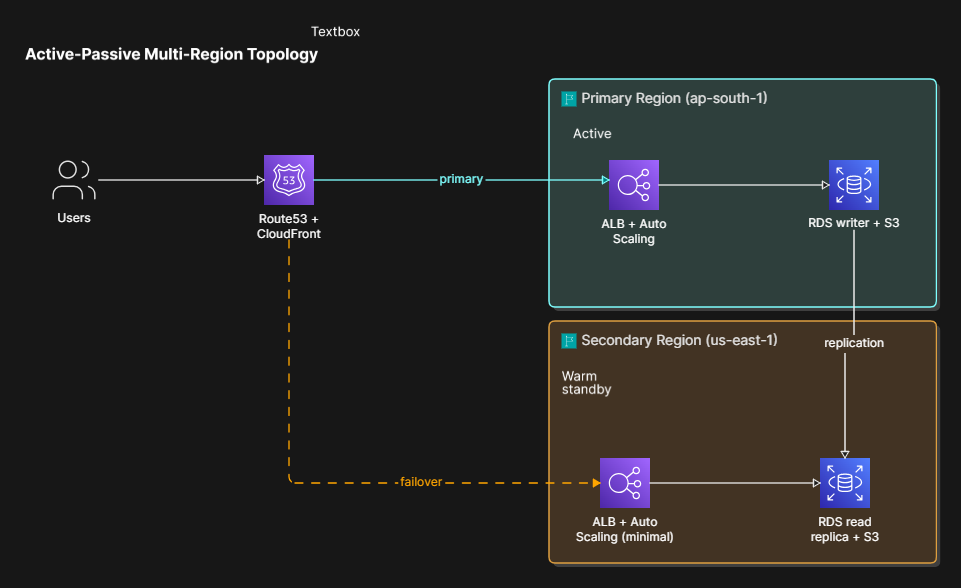

# Architecture

## Topology

Active-passive: `ap-south-1` serves all live traffic under normal operation. `us-east-1` stays warm with minimal Auto Scaling capacity and an RDS read replica, promoted only on failover. Route53 health checks monitor the primary; failure triggers Route53 failover routing to the secondary, with the RDS replica promoted to writer as part of the failover procedure.

Rejected active-active: adds data-consistency and write-conflict complexity, plus continuous double-cost, without a hard zero-downtime requirement to justify it. Active-passive also pairs naturally with Route53 failover routing (Phase 5).

## Regions

- **Primary:** `ap-south-1` (Mumbai) — lowest latency for testing/dev
- **Secondary:** `us-east-1` (N. Virginia) — cheapest cross-region data transfer, broadest service parity, most-documented region for troubleshooting

**Rationale:** Serve users from the nearest region, fail over to a well-supported, low-cost global fallback region when the primary is unavailable.

## Terraform Module Structure

One shared `modules/region` module, consumed via `environments/primary.tfvars` and `environments/secondary.tfvars`, with an `is_primary` flag toggling ASG size and RDS writer-vs-replica behavior. Global Route53/CloudFront resources live outside the module, since they're not per-region.

## Data Replication Strategy

_(RDS cross-region replica / Aurora Global Database, S3 CRR — Day 6-7)_

## Traffic Routing

_(Route53 + CloudFront design — Day 8-9)_

## Failover Process

_(Route53 failover policy, RDS promotion automation — Day 10-11)_
